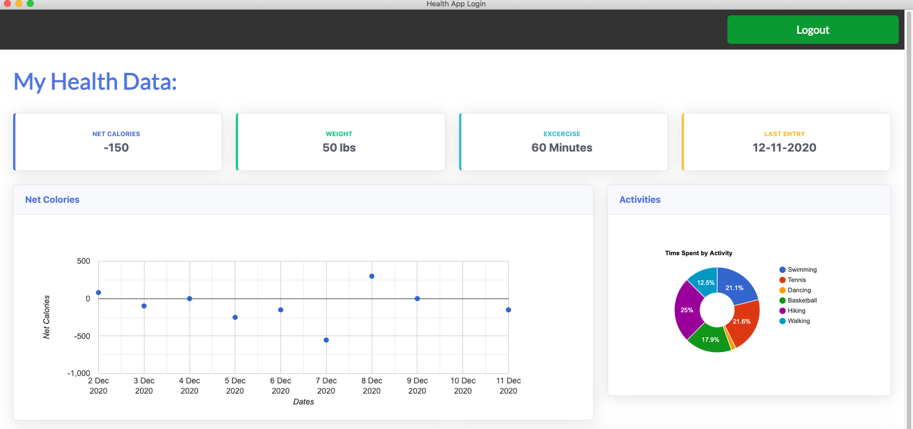
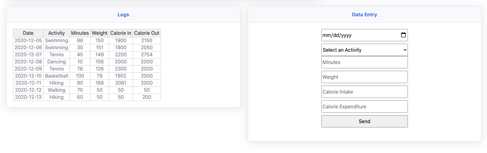

Cross Platform Electron Desktop Application that allows users to monitor health and fitness data. 

Allows users to enter calories in , calories out, weight, and excercie name and time. Displays net calories on a scatter lot and activites on a donut chart. Allows users to register, reset password, or login with username and password on startup.

Stores userdata in MongoDb database.

To run:
1. clone repo
2. npm install
3. npm start

